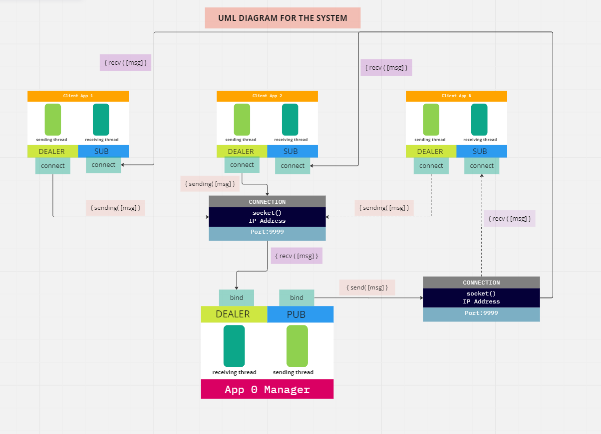

# App 0 Manager - Client App {N} System using ZeroMQ library

## Description
Two separate applications are developed for this system, one which is the ***App 0 Manager*** and the other a ***Client App*** program

This is an example of how ***ZeroMQ*** messaging library can be used to exchange files between two connected system(s). Three important specifications to be aware of are:

* "App 0 Manager”– should be able to send and receive messages with any client App (“Client App 1”, “Client App2”, ...., “Client App {N}” )
* “Client App 1” – can send and receive messages from “App 0 Manager”
* “Client App 2” – can send and receive messages from “App 0 Manager”
* “Client App {N}” – can send and receive messages from “App 0 Manager”

### How to get started:
#### Files needed:
  * AppManager.py
  * ClientApp.py

      **Note:** *Only one **Client App** program was created. This implies that multiple client appliction could be run at the same time, thus creating a single aplication for the client was optimum for this messaging system.*

  This solution is Terminal-based and the following steps can be followed for execution.

  #### Steps:
  1. Have python3 installed on your machine
  2. Create a virtual environment for the program to be executed
      1. Link to creating a virtual environment on Windows: [CLICK HERE](https://linuxhint.com/python-requirements-txt-file/ "Windows link")
      2. Link to creating a virtual environment on Linux: [CLICK HERE](https://mothergeo-py.readthedocs.io/en/latest/development/how-to/venv.html "Linux link")

  3. *Activate your virtual environment* and **install the requirements for this project.** 
  ```
  pip install -r requirements
              OR
  pip3 install -r requirements
  ```
  4. Open 3 terminals and change path to the location where both AppManager.py and ClientApp.py are installed. Type each of the following commands below into the terminals to run the applications
  ```powershell 
  python AppManager.py  on the 1st terminal
  python ClientApp.py   on the 2nd terminal
  python ClientApp.py   on the 3rd terminal
  ```


### Features
- [x] *“Client App {N}”* is able to send and receive messages **asynchronously *(uses DEALER socket)***
- [x] *“App 0 Manager”* is able to send and receive messages __asynchronously *(uses DEALER socket)*__
- [x] *“App 0 Manager”* is able to receive messages from any clients prior to the establiishment of connections
- [x] Any *“Client App {N}”* can send a message or messages to the *“App 0 Manager”* without an initial message from the *“App 0 Manager”
- [x] The *“App 0 Manager”* can send out a message or messages without receiving any initial message from any *“Client App {N}”* connected to it
- [x] When the *“App 0 Manager”* sends a message, every Client connected to it receives the same message at the exact same time. In other words, the *App 0 Manager* will be broadcasting its messages to the Client Apps connected to it ***(Pub-Sub data distribution pattern).***
- [ ] ***UI/UX* for exchanging messages instead of using a Linux or Windows terminal**
- [ ] ***Database* integration for saving and reloading historical conversations**


### Requirements for this projects
  * Programming Language: ***python3 (any version of 3.x.x)***
  * Libraries used: ***pyzmq, threading, sys, and time***
  * Database: TBD
  * Front-End Technologies: TBD 
  * Back-End Technologies: TBD

## SYSTEM ARCHITECTURE
